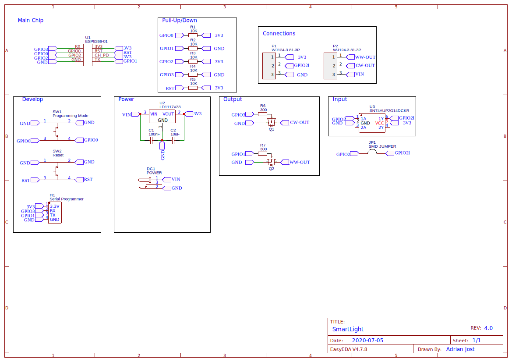
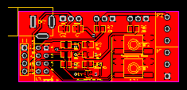
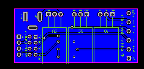

# SmartLight Hardware

This Version was designed with the awesome web tool https://easyeda.com. You can find the complete project [here](https://easyeda.com/adrian.aus.berlin/SmartLight-6ff7039580814d20a6c5e83e7830ab1b) and can modify it.

<a href="./Gerber_SmartLight-V4.0.zip" download target="_blank">
  

    
  

</a>

## Assembling

The full tutorial can be found at: [https://docs.smartlight.ga](https://docs.smart-light.ga/setup/build-the-hardware).

## Schematic

  

## PCB(s)

  
  
  

## Known Issues & Workarounds

- do not populate R2, R4 and R5, those will prevent the ESP from booting and are not required.
