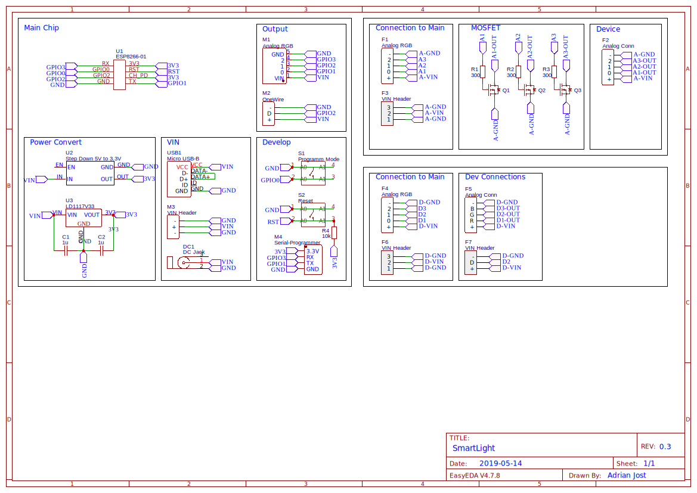
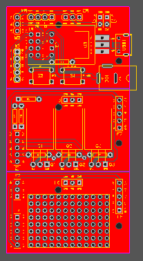
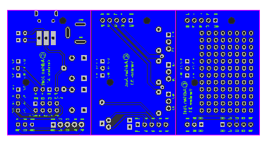

# SmartLight Hardware

This Version was designed with the awesome web tool https://easyeda.com. You can find the complete project [here](https://easyeda.com/adrian.aus.berlin/SmartLight-6ff7039580814d20a6c5e83e7830ab1b) and can modify it.

<a href="./Gerber_SmartLight-V3.1.zip" download target="_blank">
  

    
  

</a>

## Assembling

The full tutorial can be found at: [https://docs.smartlight.ga](https://docs.smartlight.ga/setup/build-the-hardware).

## Schematic

  

## PCB(s)

  
  

## Known Issues & Workarounds

## ESP is not booting when the MOSFET PCB is connected [#2](https://github.com/adrianjost/SmartLight-Hardware/issues/2)

**Solution:**

1. Power up the ESP without the MOSFET PCB connected and only connect the PCB a couple of seconds later.
2. Remove the R5, R6, R7 resistors.
